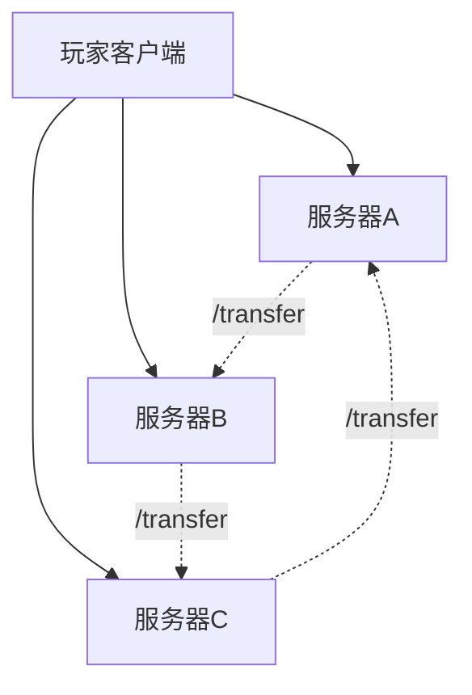

# Transfer 跨服搭建

## 什么是 Transfer？

Transfer 是 Minecraft 1.20.5 版本引入的**原生跨服功能**，与传统代理端不同，它采用去中心化架构，服务器之间直接传送玩家。



## 版本要求

- **服务端**：Minecraft 1.20.5+ (Vanilla/Paper/Spigot/Purpur)
- **客户端**：Minecraft Java Edition 1.20.5+
- **不支持**：基岩版、1.20.5以下版本

## 核心配置

### 启用 Transfer 功能

在**所有服务器**的 `server.properties` 中添加：

```properties
# 启用 Transfer 功能（关键配置）
accepts-transfers=true

# 每个服务器使用不同端口
server-port=25565

# 所有服务器的验证模式必须一致
online-mode=false
```

### 网络配置要求

:::warning 重要：网络访问要求

Transfer 要求**所有服务器都能被客户端直接访问**：

:::

## Transfer 的安全问题

:::danger 重要安全警告

Transfer **没有内置的安全机制**，与传统代理端不同：
- 玩家可以直接连接任何服务器，绕过登录验证
- 缺乏统一的身份验证和权限管理
- 在离线模式下存在身份冒充风险

:::

### 解决方案

#### 方案一：启用正版验证

所有服务器设置 `online-mode=true`

#### 方案二：OnlyTransfer 插件
专门解决 Transfer 安全问题的插件：

**主要功能：**
- 阻止玩家直接连接非登录服
- 基于令牌验证服务器间传送
- 白名单控制允许的服务器

**版本要求：** Spigot/Paper 1.21.4+

**基础配置：**
```yaml
# 是否允许通过服务器列表直接进入服务器
# 如果为 true，则该服务器被允许直接通过客户端进入，否则将仅允许 transfer
# 如果不是主城或者登录服，不建议打开该选项，否则安全性降低
allow-server-list: true

# 跨服传送的令牌，两台服务器必须配置相同的令牌
# 类似于 Velocity 的`forward.secret`
# 但貌似只有被传送的对象服务器才会检查这个
transfer-token: "your-secure-random-token"

# 允许的服务器IP和端口
# 不在该列表里的服务器不被允许跳转
# 如果是公共服务器，请确保所有子服均暴露在公网下

allowed-servers:
  - "your-server-ip:25566"
  - "your-server-ip:25567"

# 游戏服：禁止直接进入
allow-server-list: false
transfer-token: "your-secure-random-token"  # 相同令牌
allowed-servers:
  - "your-server-ip:25565"  # 登录服
```

:::tip 安全令牌生成
```bash
# 生成32位随机令牌
openssl rand -base64 32
```
:::

## 与 Velocity 混合使用

Velocity 支持接收 Transfer 传送，可以实现混合架构：

```toml
# velocity.toml
accepts-transfers = true
```

**混合架构示例：**
```text
独立服务器 --Transfer--> Velocity ---> 子服务器群组
```

:::warning 兼容性问题
OnlyTransfer 插件与 Velocity 的 Transfer 支持存在部分兼容性问题，建议在测试环境中验证。
:::

