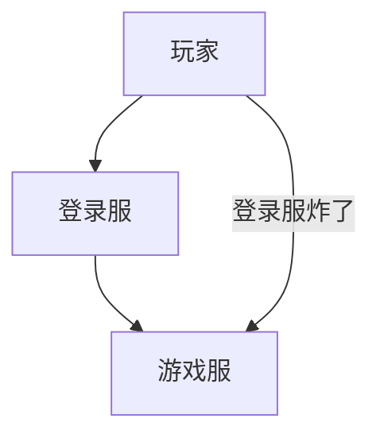

# 登录/大厅服

在你的服务器配置登录服或大厅服。

登录服和大厅服在原理上一样，所以这里只讲解登录服。

## 基础配置

在 `velocity.toml` 中找到：

```toml
# 当玩家登录或从服务器被踢出时，我们应该尝试让他进入哪个服务器？
try = [
    "lobby"
]
```

在这里只配置你的登录服，不要将游戏服写在这里！

否则当你的登录服因为某些原因崩溃时，玩家可以随意登录其他人账号，绕过登录直接加入游戏服。



## 必要插件配置

### 登录插件

**在你的登录服安装 [登录插件](/docs-java/process/plugin/other/Login/Login.md)**

提供登录验证。

如果你使用 AuthMe，建议在 Velocity-CTD 安装 [AuthMeVelocity](https://modrinth.com/plugin/authmevelocity)。

### 大厅插件

**在你的登录服安装 [大厅插件](/docs-java/process/plugin/WorldManagement/lobby/lobby.md)**

提供各种大厅常用的功能如：

- 世界保护
- 关闭雨雪
- 关闭伤害
- 二段跳
- 物品栏菜单
- 掉虚空返回
- 阻止丢出物品

当然你也可以不用大厅插件，用别的插件来补全这些功能。

### 跨服传送插件

#### 安装跨服传送插件

在你的登录服安装提供跨服传送的插件

使用这些插件将你的玩家从登录服传送到其他子服，可参考 [加入服务器](../../join-server.md)。

## Velocity-CTD 特有功能

### 内置 Hub 命令

Velocity-CTD 内置了 `/hub` 和 `/lobby` 命令，玩家可以随时返回大厅服务器：

```toml
[commands]
hub = true  # 启用 /hub 和 /lobby 命令

[commands.aliases]
hub = ["lobby", "l", "spawn"]  # 设置命令别名
```

权限配置：
```yaml
# 允许使用 hub 命令
velocity.command.hub: true
```

### 智能回退系统

配置多个大厅服务器实现负载均衡：

```toml
[fallback]
selection-mode = "least"  # 选择人数最少的服务器
dynamic-fallbacks = ["lobby1", "lobby2", "lobby3"]

[servers]
lobby1 = "127.0.0.1:25501"
lobby2 = "127.0.0.1:25502"
lobby3 = "127.0.0.1:25503"

try = [
    "lobby1", "lobby2", "lobby3"
]
```

### 队列系统集成

为大厅服务器配置队列系统，防止过载：

```toml
[queue]
enabled = true
# 大厅服务器通常不需要队列，但可以作为备用
```

如果大厅服务器满员，玩家会自动排队等待。

## 高级配置

### 消息自定义

自定义大厅相关的消息：

```toml
[messages]
enable-minimessage = true
hub-teleport = "<green>正在传送到大厅服务器..."
hub-unavailable = "<red>大厅服务器暂时不可用"
fallback-connecting = "<yellow>正在连接到备用服务器..."
```

### 服务器品牌设置

设置自定义的服务器品牌：

```toml
[performance]
server-brand = "我的服务器网络"
```

### 大厅服务器保护

配置大厅服务器的特殊设置：

```toml
# 为大厅服务器禁用某些功能
[performance]
disable-forge-handshake = true  # 如果大厅不使用 Mod
```

## 多大厅架构

### 分区大厅

为不同类型的玩家配置不同的大厅：

```toml
[servers]
lobby-new = "127.0.0.1:25501"      # 新手大厅
lobby-vip = "127.0.0.1:25502"      # VIP 大厅
lobby-event = "127.0.0.1:25503"    # 活动大厅

# 根据权限分配不同的大厅
try = [
    "lobby-new"
]

[forced-hosts]
"vip.example.com" = ["lobby-vip"]
"event.example.com" = ["lobby-event"]
```

### 地区分布

为不同地区的玩家配置就近的大厅：

```toml
[servers]
lobby-asia = "asia.example.com:25577"
lobby-eu = "eu.example.com:25577"
lobby-us = "us.example.com:25577"
```

## 故障转移配置

### 自动故障转移

当主大厅服务器不可用时，自动切换到备用服务器：

```toml
[fallback]
selection-mode = "cycle"  # 循环选择可用服务器
dynamic-fallbacks = ["lobby-main", "lobby-backup1", "lobby-backup2"]

[advanced]
failover-on-unexpected-server-disconnect = true
```

### 健康检查

Velocity-CTD 会自动检查服务器健康状态，不可用的服务器会被暂时移除。

## 性能优化

### 大厅服务器优化

针对大厅服务器的特殊优化：

```toml
[performance]
# 大厅通常不需要复杂的转发
disable-header-footer-translation = true

# 如果大厅不使用 Forge
disable-forge-handshake = true
```

### 连接优化

优化玩家连接到大厅的体验：

```toml
[advanced]
# 减少连接超时时间
connection-timeout = 3000

# 优化登录限制
login-ratelimit = 1000
```

## 监控和维护

### 大厅状态监控

使用内置命令监控大厅状态：

```bash
# 查看玩家分布
/plist

# 查看服务器运行时间
/velocity uptime

# 查看队列状态（如果启用）
/queueadmin listqueues
```

### 维护模式

在维护期间的配置：

```toml
[messages]
maintenance-message = "<red>服务器正在维护中，请稍后再试"

[performance]
# 临时修改 MOTD
motd = "<red>维护中 - 预计 30 分钟后恢复"
```

## 最佳实践

### 安全建议

1. **隔离登录服**：确保只有登录服在 `try` 列表中
2. **权限控制**：合理配置各种命令的权限
3. **监控日志**：定期检查登录相关的日志

### 性能建议

1. **负载均衡**：使用多个大厅服务器分散负载
2. **就近连接**：为不同地区配置就近的大厅
3. **资源优化**：大厅服务器通常不需要太多资源

### 用户体验

1. **快速连接**：优化连接超时设置
2. **清晰提示**：自定义友好的消息提示
3. **备用方案**：配置完善的故障转移机制

## 故障排除

### 常见问题

#### 问题：玩家无法连接到大厅
- 检查大厅服务器是否正常运行
- 验证 `try` 配置是否正确
- 查看代理服务器日志

#### 问题：Hub 命令不工作
- 确认命令已启用：`commands.hub = true`
- 检查玩家权限：`velocity.command.hub`
- 验证回退服务器配置

#### 问题：负载不均衡
- 检查 `selection-mode` 设置
- 确认所有大厅服务器都在运行
- 查看 `dynamic-fallbacks` 配置

### 调试技巧

1. **启用详细日志**：
```toml
[advanced]
log-player-connections = true
log-command-executions = true
```

1. **测试连接**：使用 `/velocity uptime` 确认代理正常运行

2. **监控队列**：如果启用队列，使用 `/queueadmin list` 查看状态
