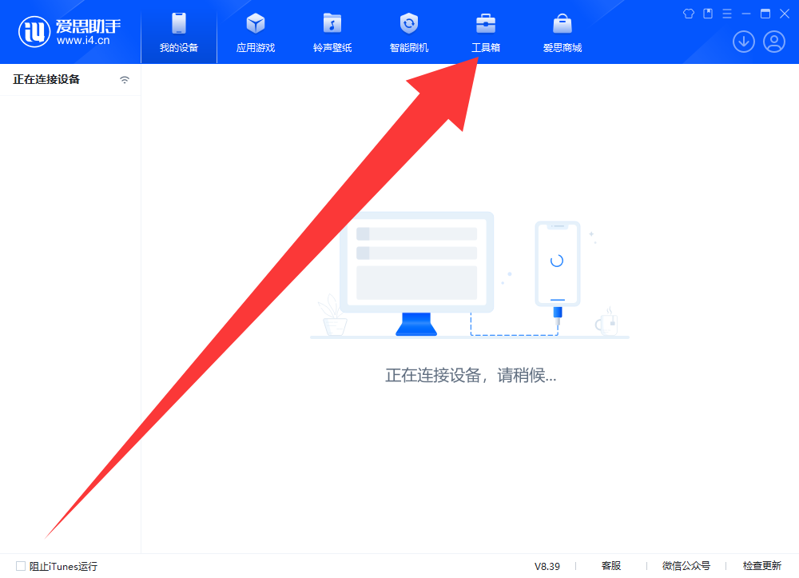
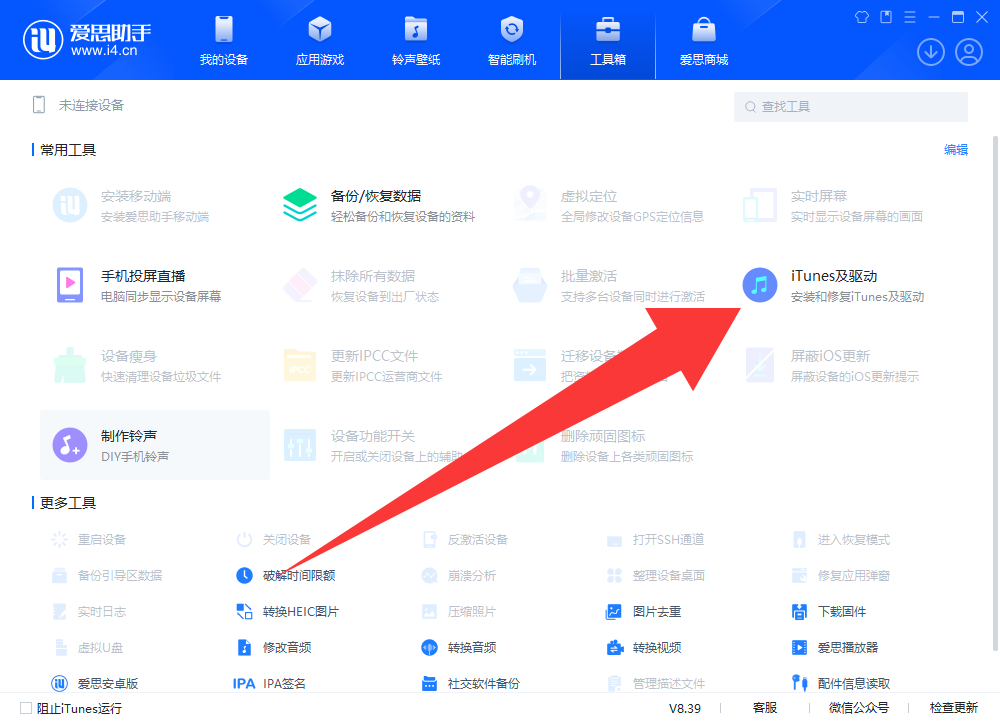
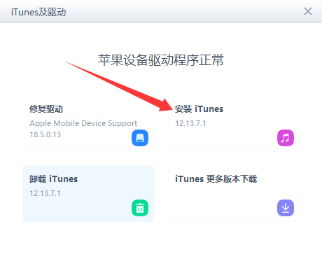
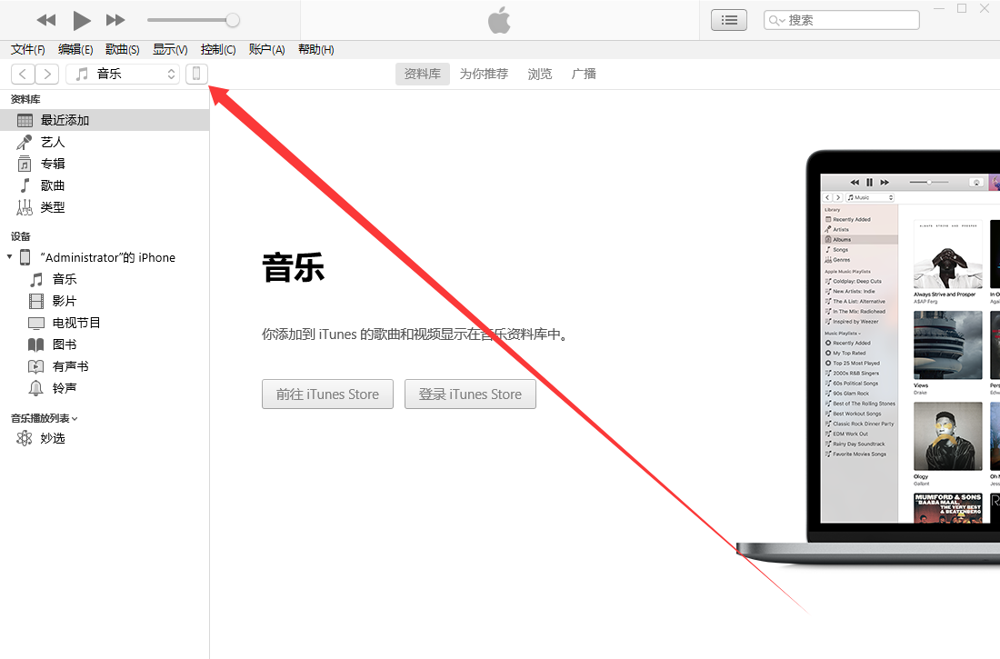
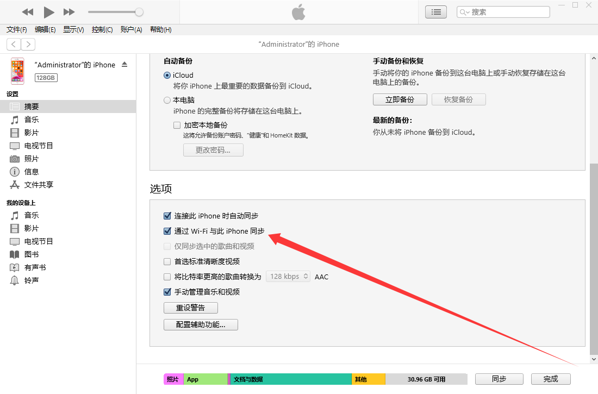
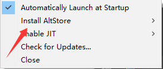
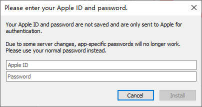

# 在 iOS 上安装 Amethyst

免越狱安装Amethyst

## 方法一：使用 AltStore

### （针对Windows用户，Windows 用户尚不支持在 iOS 17 上使用 AltJIT。）

1.点击此 [链接](i4.cn)下载爱思助手电脑端并安装

2.打开爱思助手，点击“工具箱->iTunes及驱动->安装iTunes”来安装iTunes

3.点击此 [链接](https://updates.cdn-apple.com/2020/windows/001-39935-20200911-1A70AA56-F448-11EA-8CC0-99D41950005E/iCloudSetup.exe)下载iCloud电脑端并安装

4.点击此 [链接](https://cdn.altstore.io/file/altstore/altinstaller.zip)下载AltServer

5.解压AltInstaller.zip并运行Setup.exe

6.将你的设备连接到电脑，并确保其已解锁。

7.打开iTunes，然后在设备上启用“通过Wi-Fi与此iPhone同步”

8.点击右下角任务栏中的 AltServer 图标。然后前往“Install AltStore”，并选择你的 iOS 设备。

9.输入您的 Apple ID 电子邮件地址和密码。

10.等待几秒钟，然后会出现一个 AltServer 通知，提示 AltStore 已成功安装到您的设备上。

11.在 iOS 设备上，前往“设置”->“通用”->“描述文件和设备管理”。点击“信任 您的 Apple ID”，然后再次点击“信任”进行确认。

（要在 iOS 16 或更高版本上使用 AltStore，您需要前往“设置”->“隐私和安全”->“开发者模式”在设备上启用开发者模式。）

12.从此 [链接](https://github.com/AngelAuraMC/Amethyst-iOS/actions) 下载 Amethyst 的 ipa 安装包。

#### （需要使用github账号才能继续下载）

### 手机开启JIT

13.打开“My Apps”选项卡，然后长按Amethyst。

14.按“Enable JIT”启动应用程序，几秒钟内您就会看到 AltStore 通知，提示 JIT 已启用。

### 电脑开启JIT

16.首先，确保Amethyst在设备前台运行。

17.点击右下角任务栏中的 AltServer 图标。然后点击“Enable JIT”>您的设备，然后选择Amethyst

## 方法二：使用 TrollStore

### 支持范围

A8处理器的iPhone，iPad等在iOS/iPadOS 14.0 beta 2 ~ 15.8.4	可以安装

A9-A11处理器的iPhone，iPad等在iOS/iPadOS 14.0 beta 2 ~ 17.0 除16.7.x（不包含RC）以外可以安装

A12-A17/M1-M2处理器的iPhone，iPad等在iOS/iPadOS 14.0 beta 2 ~ 17.0 除16.7.x（不包含RC）以外可以安装

### 安装 TrollStore

#### 以下方法支持固件版本 14.0 至 15.1.1 的所有 iOS/iPadOS 设备、固件版本 15.2 至 16.6.1 的 A9(X) 

#### 以及更高版本设备以及版本 17.0 beta 1至 17.0 beta 4的 A10(X) 设备。

1.点击此 [链接](i4.cn)下载爱思助手电脑端并安装。

2.将你的设备连接到电脑，并确保其已解锁。

3.点击此 [链接](https://github.com/alfiecg24/TrollInstallerX/releases/latest/download/TrollInstallerX.ipa)下载 TrollInstallerX。

4.打开爱思助手，点击“工具箱->iTunes及驱动->安装iTunes”来安装iTunes。

5.在爱思助手中，点击“工具箱->IPA签名->添加IPA文件”将你下载好的TrollInstallerX选中，之后点击打开

6.在刚刚的IPA签名的窗口中，点击使用Apple ID签名，点击添加Apple ID

7.现在，在使用Apple ID窗口中，填写你的Apple ID和密码

8.在UDID（设备标识）中选择与你设备UDID相同的一项，点击确定

9.选择TrollInstallerX和你刚才添加的Apple ID,点击开始签名

10.签名成功后点击打开已签名IPA位置，双击TrollInstallerX.ipa，选择你的设备点击安装

11.在你的设备上，前往“设置”->“通用”->“描述文件和设备管理”。点击“信任 [您的 Apple ID]”，然后再次点击“信任”进行确认

（iOS 16 或更高版本上使用 TrollInstallerX，您需要前往“设置”->“隐私和安全”->“开发者模式”在设备上启用开发者模式。）

12.打开TrollInstallerX，点击“Install TrollStore”

13.当提示要“ install the persistence helper ”请点击您**最不关心的应用程序**

（如果您不知道点击哪个应用，请选择Tips）

14.在适用于 A15、A16 和 M2 设备的 iOS 16.5.1 以及适用于 A12 及更高版本的设备的 iOS 16.6 至 16.6.1 上，

你需要打开你安装的“persistence helper”并且点击Install TrollStore

15.从此 [链接](https://github.com/AngelAuraMC/Amethyst-iOS/actions) 下载 Amethyst 的 tipa 安装包。

#### （安装包需要使用github账号才能继续下载）

16.打开Amethyst

#### 以下方法支持iOS/iPadOS 15.0 至 15.5 beta 4 和 15.6 beta 1 至 15.6 beta 3  A11 及更早版本的设备

#### iOS/iPadOS 14.0 beta 2 至 15.6.1 和 16.0 beta 1 至 16.0 beta 3 A12 及更高版本的设备

1.打开 Safari

2.在您的设备上打开此页面

3.在您的设备上，点击[此处](itms-services://?action=download-manifest&url=https://jailbreaks.app/cdn/plists/TrollHelper.plist)

（如果您无法访问此页面，请itms-services://?action=download-manifest&url=https://jailbreaks.app/cdn/plists/TrollHelper.plist在 Safari 中输入）

4.点击Install

5.一个名为的应用程序GTA Car Tracker现在将安装到您的设备上

6.打开GTA Car Tracker，点击Register Persistence Helper，点击Install TrollStore

（如果重新启动，重新执行第六步）

7.从此 [链接](https://github.com/AngelAuraMC/Amethyst-iOS/actions) 下载 Amethyst 的 tipa 安装包。

#### （tipa 安装包需要使用github账号才能继续下载）

8.打开Amethyst

#### 以下方法支持iOS/iPadOS 16.7 RC、17.0 beta 5~17.0

1.安装python3最新版本，[官网下载地址](https://www.python.org/downloads/)。

2.点击此 [链接](i4.cn)下载爱思助手电脑端并安装。

3.打开爱思助手，点击“工具箱->iTunes及驱动->安装iTunes”来安装iTunes

4.下载[TrollRestore](https://github.com/JJTech0130/TrollRestore/releases/download/1.0/TrollRestore.exe)

5.将你的设备连接到电脑，并确保其已解锁。

6.打开文件资源管理器，找到下载/提取的文件的保存位置。

7.双击TrollRestore

8.出现提示时，输入要覆盖的系统应用程序的名称，然后按回车键

（如果您不确定要覆盖哪个应用程序，请通过输入覆盖 Tips 应用程序Tips）

9.解锁您的设备，打开你覆盖的系统应用程序，点击Install TrollStore

10.从此 [链接](https://github.com/AngelAuraMC/Amethyst-iOS/actions) 下载 Amethyst 的 tipa 安装包。

#### （在GitHub Actions需要使用github账号才能继续下载）

11.打开Amethyst

剩下方法之后再说
