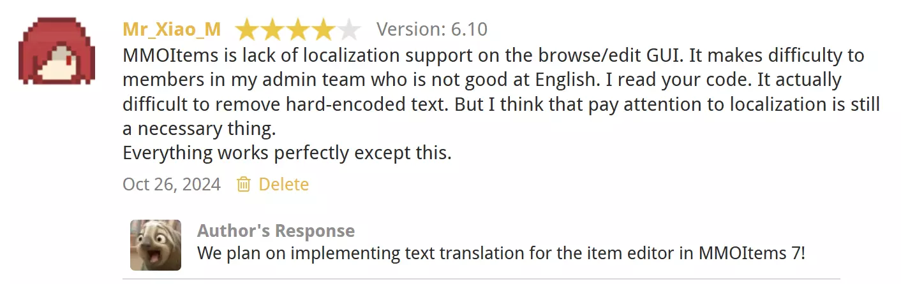

# MMOItems

:::info

`SpigotMC` https://www.spigotmc.org/resources/.39267

`GitLab` https://gitlab.com/phoenix-dvpmt/mmoitems

`文档(英文)` https://gitlab.com/phoenix-dvpmt/mmoitems/-/wikis/home

`文档(中文)` https://mmoitems.magicmc.top

:::

知名的屎山物品库插件，自带属性，技能，合成等一堆功能

有很多人用多种方式对其汉化，这是其中两个：

- https://www.minebbs.com/resources/.9699
- https://github.com/MagicMC-Dev/MMOItems-Zh

作者在 Review 中回复，MMOItems 更新到 7.0 后将支持编辑界面的本地化。

# Bstats

