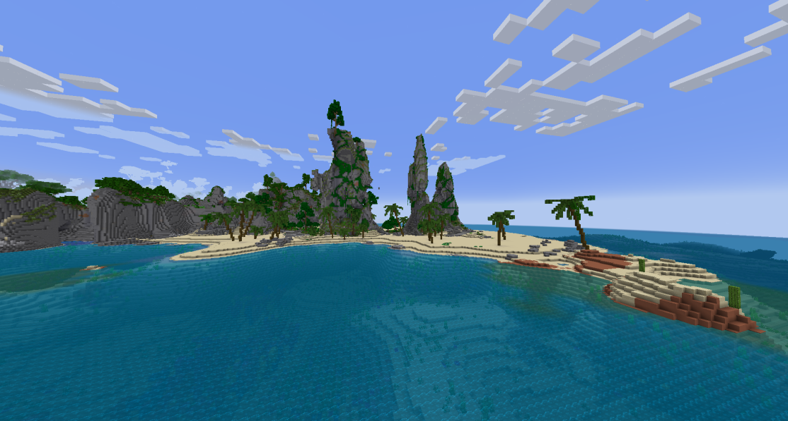
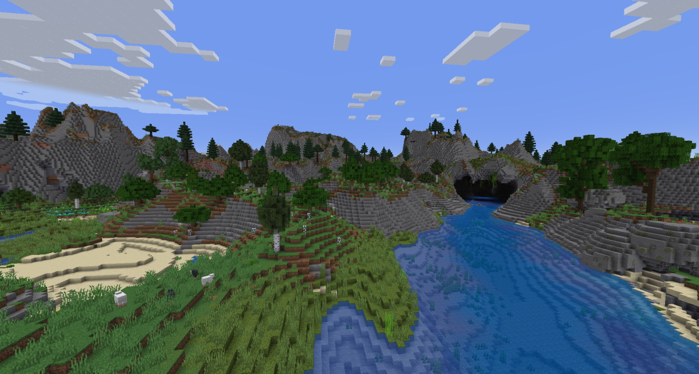
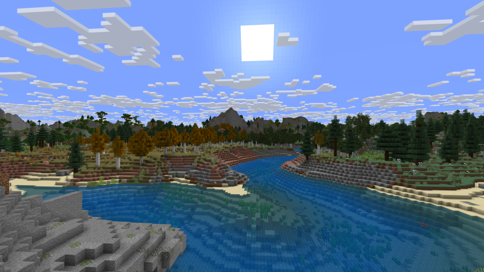
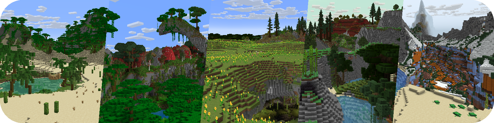
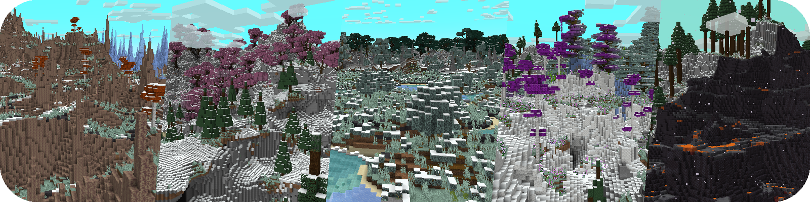
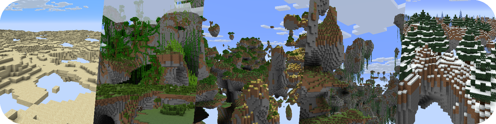
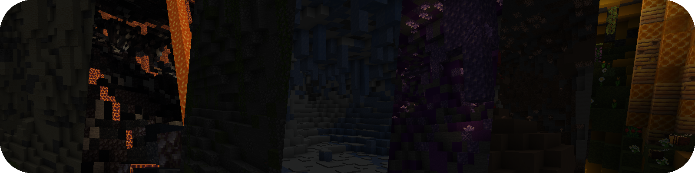

# Terra

与其他生成器（如 RTG 依赖代码层修改）不同，Terra 不预设任何地形或生物群系规则，所有生成逻辑（地形噪声、结构分布、植被生成等）均通过配置文件动态定义

## 官方预设

## 社区扩展

## 链接

:::info

`SpigotMC` https://www.spigotmc.org/resources/.85151

`Modrinth` https://modrinth.com/plugin/terra

`MineBBS` https://www.minebbs.com/resources/.8278

`GitHub` https://github.com/PolyhedralDev/Terra

`文档(英文)` https://terra.polydev.org/install/index.html

`插件百科` https://mineplugin.org/Terra

:::

## Bstats

