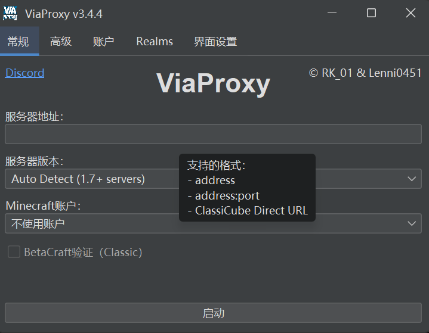

# 安装和基础配置

本文档将详细介绍 ViaProxy 的下载、安装和基础配置方法。

## 下载 ViaProxy

### 稳定版本
从 [GitHub Releases](https://github.com/ViaVersion/ViaProxy/releases/latest) 下载最新的稳定版本。

`java8` 是 Java 8 的兼容版本

### 开发版本

从 [ViaVersion Jenkins](https://ci.viaversion.com/view/All/job/ViaProxy/) 下载最新的开发版本。


### Docker 镜像
ViaProxy 也提供 Docker 镜像，适合容器化部署。

```bash
# 拉取最新镜像
docker pull ghcr.io/viaversion/viaproxy:latest

# 运行容器
docker run -it -v /path/to/data:/app/run -p 25568:25568 ghcr.io/viaversion/viaproxy:latest
```


## 运行
```bash
# 运行 ViaProxy（GUI 模式）
java -jar ViaProxy-3.4.4.jar

# 或者运行 CLI 模式查看帮助
java -jar ViaProxy-3.4.4.jar cli --help
```

## 运行模式

### GUI 模式（推荐新手）

GUI 模式提供图形界面，操作简单直观。

```bash
java -jar ViaProxy-3.4.4.jar
```



### CLI 模式

CLI 模式适合脚本化部署和服务器环境。

```bash
# 查看所有可用参数
java -jar ViaProxy-3.4.4.jar cli --help

# 基本启动命令
java -jar ViaProxy-3.4.4.jar cli \
  --bind-port 25568 \
  --target-ip play.example.com \
  --target-port 25565 \
  --version 1.20.1
```

#### CLI 参数详解

##### 基础连接参数
- `--bind-address <地址:端口>` - 监听地址和端口 (默认: 0.0.0.0:25568)
- `--target-address <地址:端口>` - 目标服务器地址 (默认: 127.0.0.1:25565)
- `--target-version <版本>` - 目标服务器版本 (默认: 自动检测)

##### 认证配置
- `--auth-method <方式>` - 认证方式 (默认: NONE)
- `--proxy-online-mode <true/false>` - 代理正版模式 (默认: false)
- `--minecraft-account-index <索引>` - 使用的 Minecraft 账户索引

##### 高级功能
- `--chat-signing <true/false>` - 聊天签名支持 (默认: true)
- `--simple-voice-chat-support <true/false>` - 简单语音聊天支持 (默认: false)
- `--resource-pack-url <URL>` - 自定义资源包地址

### 配置文件模式（推荐自动化部署）

配置文件模式适合复杂配置和自动化部署。

```bash
java -jar ViaProxy-3.4.4.jar cli
```