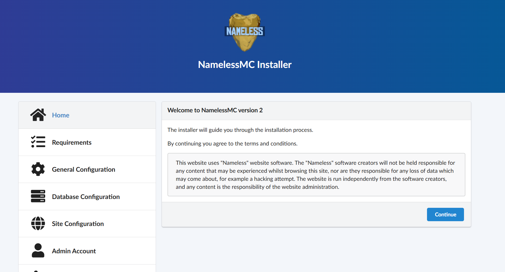
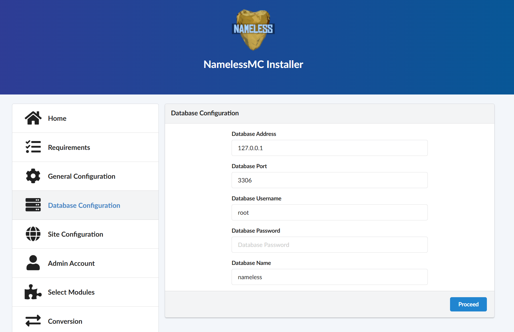
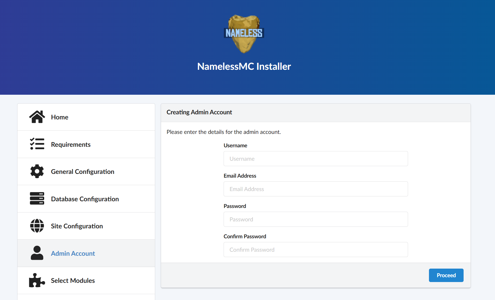
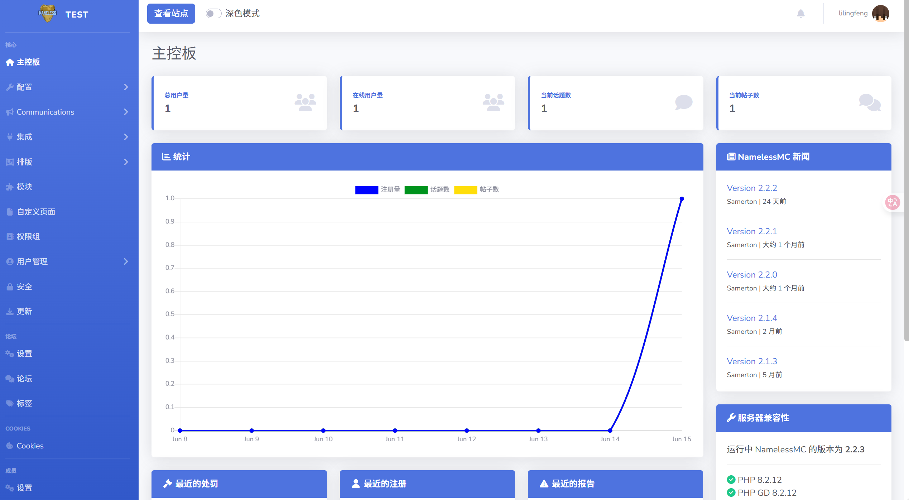
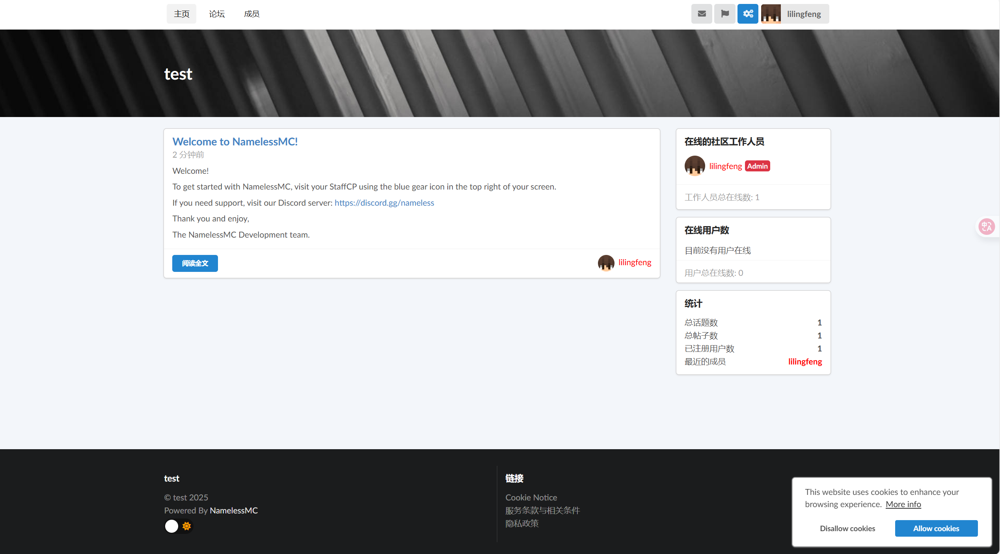

import Tabs from '@theme/Tabs';
import TabItem from '@theme/TabItem';

# 安装

配置好基础环境后开始安装 NamelessMC

## 下载

<Tabs groupId="download-method">
<TabItem value="direct" label="直接下载">


```bash

curl -L "https://github.com/NamelessMC/Nameless/releases/latest/download/nameless-deps-dist.tar.xz" | tar --xz --extract --directory=/var/www/html --file -

wget -O - "https://github.com/NamelessMC/Nameless/releases/latest/download/nameless-deps-dist.tar.xz" | tar --xz --extract --directory=/var/www/html --file -

```

如果你是 Windows,直接下载解压到网站目录即可(Apache 通常是 `htdocs`)

</TabItem>
<TabItem value="git" label="Git">

不推荐这么干,容易爆炸

```bash
# 克隆最新版本
git clone --branch v2 https://github.com/NamelessMC/Nameless.git /var/www/html/namelessmc
```

</TabItem>
<TabItem value="composer" label="Composer">

```bash
# 通过Composer安装
composer create-project namelessmc/nameless /var/www/html/namelessmc
```

</TabItem>
<TabItem value="docker" label="Docker">

1. **安装Docker Compose** (Debian/Ubuntu):
   ```bash
   sudo apt install docker-compose-plugin
   ```

2. **下载配置文件**
   ```bash
   # 下载docker-compose.yaml文件
   wget https://github.com/NamelessMC/Nameless-Docker/blob/master/docker-compose.yaml
   ```

3. **准备数据目录**
   ```bash
   # 创建网站数据目录并设置权限
   mkdir web
   chown -R 33:33 web
   ```

4. **启动容器**
   ```bash
   docker compose up -d
   ```

5. **完成安装**
   - 访问 http://localhost:80
   - 数据库地址填写: `db`
   - 数据库用户名、密码、数据库名都填写: `nameless`

### 推荐Docker标签
- `v2.2`: 最新稳定版 (PHP 8.3)
- `v2.1`: 上一稳定版 (PHP 8.2)  
- `dev`: 开发版 (仅用于开发)

</TabItem>
</Tabs>

### 2. 设置文件权限

<Tabs groupId="operating-systems">
<TabItem value="ubuntu" label="Ubuntu/Debian">

```bash
# 设置所有者
sudo chown -R www-data:www-data /var/www/html/namelessmc

# 设置目录权限
sudo find /var/www/html/namelessmc -type d -exec chmod 755 {} \;

# 设置文件权限
sudo find /var/www/html/namelessmc -type f -exec chmod 644 {} \;

# 设置特殊目录权限
sudo chmod -R 777 /var/www/html/namelessmc/cache
sudo chmod -R 777 /var/www/html/namelessmc/uploads
```

</TabItem>
<TabItem value="centos" label="CentOS/Rocky Linux">

```bash
# 设置所有者
sudo chown -R nginx:nginx /var/www/html/namelessmc

# 设置SELinux上下文 (如果启用SELinux)
sudo restorecon -R /var/www/html/namelessmc
sudo setsebool -P httpd_can_network_connect 1
sudo setsebool -P httpd_can_network_connect_db 1

# 设置权限
sudo find /var/www/html/namelessmc -type d -exec chmod 755 {} \;
sudo find /var/www/html/namelessmc -type f -exec chmod 644 {} \;
sudo chmod -R 777 /var/www/html/namelessmc/cache
sudo chmod -R 777 /var/www/html/namelessmc/uploads
```

</TabItem>
<TabItem value="shared" label="共享主机">

```bash
# 通过FTP客户端或文件管理器设置权限
# 文件权限：644
# 目录权限：755
# 特殊目录权限：777
# - cache/
# - uploads/
```

**注意**：某些共享主机可能不允许777权限，请尝试755或按主机商要求设置。

</TabItem>
</Tabs>

### Web安装向导

1. **访问安装页面**
   - 打开浏览器访问：`http://your-domain.com/install`
   - 或：`http://your-domain.com/namelessmc/install`



1. **数据库配置**
   ```text
   数据库类型：MySQL
   主机地址：localhost (或你的数据库主机)
   端口：3306
   数据库名：namelessmc
   用户名：namelessmc
   密码：your_secure_password
   表前缀：nl2_ (可自定义)
   ```
   


1. **站点配置**
   ```text
   站点名称：你的服务器名称
   站点URL：完整的域名地址
   友好URL：启用 (推荐)
   ```

1. **管理员账户**
   ```text
   用户名：admin (可自定义)
   邮箱：admin@yourdomain.com
   密码：强密码
   确认密码：重复输入
   ```


然后就安装好了





接下来自己摸索即可