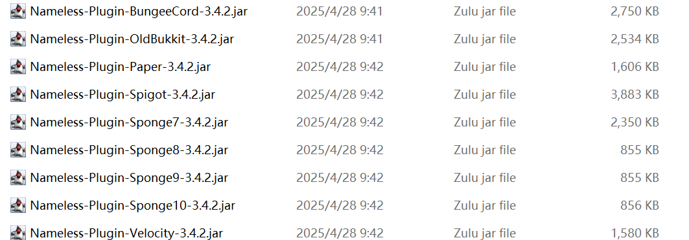
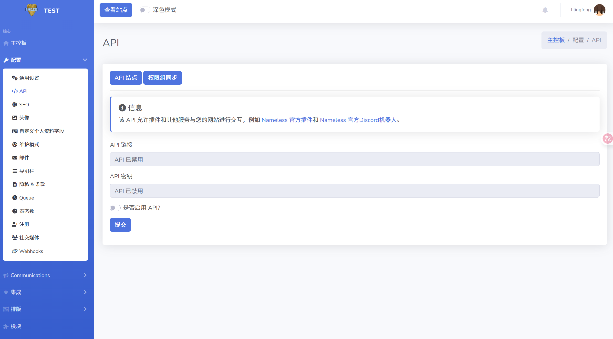
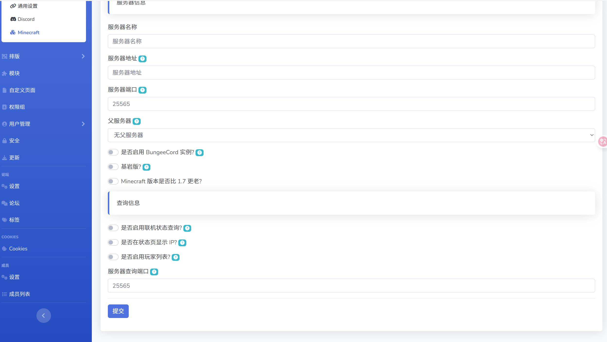
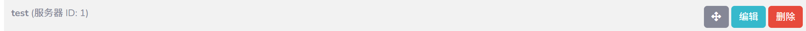

# 插件

接下来你需要安装插件实现 Minecraft 服务器数据同步

首先在这里下载 [SpigotMC](https://www.spigotmc.org/resources/nameless-plugin-for-v2.59032/)

解压后根据你的服务器版本选择对应的插件,通常选择 `Paper` 即可



## 配置



首先在这里启用 API 接口

```yaml
api:
  # 填在这里
  url: ""
  key: ""
```

然后打开配置文件 `main.yml` 进行配置,填完后执行 `/nlpl reload`



然后接下来需要创建一个服务器,创建好后,复制服务器的 ID,填入配置文件中的`server-id` 即可(记得重新加载)



## 插件配置文件

```yaml
# Nameless插件配置
# 插件运行异常？请参考故障排除指南：https://docs.namelessmc.com/en/集成/plugin-troubleshooting
# 使用命令 /nlpl reload 重载插件

api:
  # 启用API并在 核心 > 配置 > API 获取API网址和API密钥
  url: "http://localhost/index.php?route=/api/v2"
  key: "FZX3YAdR8nFfaHXSqUBvwXdrhJdOCERCKZ6AonUWlXk"
  # 在 核心 > 集成 > Minecraft > Minecraft 服务器 查找您的服务器ID
  server-id: 1
  # 输出网站请求与响应的详细信息
  debug: false
  # 等待网站响应的最大时间，推荐值为3到15秒
  # 语法参考：https://en.wikipedia.org/wiki/ISO_8601#Durations
  timeout: 'PT10S'
  # 若启用，插件将忽略服务器的UUID，而根据玩家用户名生成离线模式UUID以进行API请求。
  # 网站也需配置为使用离线模式UUID。
  # 此功能为实验性质，有助于基岩版（Floodgate/Geyser）兼容性。
  offline-uuids: false

# 数据发送取决于使用的平台：https://docs.namelessmc.com/en/集成/plugin-data-sender
# 此功能会周期性地向网站发送服务器数据，用于群组同步、用户名同步和占位符等功能。
# 当前网站并未使用此插件提供服务器状态与玩家列表，需在网站单独配置服务器Ping功能。
server-data-sender:
  enabled: false
  # 数据发送的时间间隔：https://en.wikipedia.org/wiki/ISO_8601#Durations
  interval: 'PT30S'
  # 发送PlaceholderAPI占位符数据，供NamelessMC（排行榜、个人主页）或其他模块使用。
  # 仅支持 oldbukkit、spigot 和 paper 平台。
  placeholders:
    enabled: false
    # 全局占位符（网站目前未使用），填写占位符名称，不包括%%
    global: []
    # 玩家特定的占位符，填写占位符名称，不包括%%
    player: []

# 若启用，将把Minecraft群组同步至网站。
#  > 在 核心 > 集成 > Minecraft > Minecraft 服务器 选择群组同步服务器
#  > 在 核心 > 配置 > API > 权限组同步 中配置群组。
# 此选项仅适用于NamelessMC v2.1.0+版本，旧版本通过server-data-sender同步群组。
group-sync:
  enabled: false
  # 群组同步间隔：https://en.wikipedia.org/wiki/ISO_8601#Durations
  interval: 'PT30S'

logging:
  # 在日志中显示更多详细信息
  verbose: false

# 玩家加入时，若未注册NamelessMC账号，向其发送消息提醒
not-registered-join-message: false

# 玩家加入时，在聊天框显示网站通知（如有）
join-notifications: false

# 有效语言列表参见 languages 目录的文件名。
# 若需帮助翻译插件，请访问：https://translate.namelessmc.com
# 若想自定义服务器消息，可编辑语言文件。
language: en_UK
datetime-format: 'yyyy-MM-dd HH:mm:ss'

# 周期性在聊天框发送网站公告消息
announcements:
  enabled: false
  # 每个<interval>间隔，从公告中随机选择一条发送给玩家
  interval: 'PT10M'
  # 若设定，仅发送指定页面的公告
  # display: Forums

# 允许玩家在注册时使用非Minecraft用户名作为账号名
register-custom-username: true

# ------------------ 以下选项仅支持 Bukkit 平台 ------------------ #

# 当玩家被封禁时，同时封禁其网站账号（事件触发，仅新封禁有效）
sync-ban-to-website: false

# 用户同步功能仅支持 oldbukkit、spigot 和 paper 平台
user-sync:
  enabled: false
  # 同步间隔（秒）
  poll-interval: 'PT30S'
  # 排除的UUID列表（这些用户不会被加入或移出白名单或封禁列表）
  # UUID需带横线格式，如启用api-usernames选项，请填写用户名。
  exclude: []

  # 自动将已注册的玩家加入白名单
  #
  # 启用后，插件将自动将网站已注册的玩家加入服务器白名单
  # 警告：所有未在网站注册的玩家会从白名单移除，包括启用前添加的玩家！
  whitelist:
    enabled: false
    # 仅允许通过验证的用户加入白名单
    verified-only: false
    # 若仅允许特定群组的用户加入白名单，请填写群组ID
    only-with-group: -1

  # 网站封禁用户自动同步至服务器，被解除封禁用户也自动同步
  bans:
    enabled: false

# 从NamelessMC获取用户信息供PlaceholderAPI使用。
# 此功能与上述发送占位符至网站不同。
# 参考：https://github.com/PlaceholderAPI/PlaceholderAPI/wiki/Placeholders#nameless-plugin
# 仅支持 oldbukkit、spigot 和 paper 平台。
retrieve-placeholders:
  enabled: false
  # 占位符检索间隔：https://en.wikipedia.org/wiki/ISO_8601#Durations
  interval: 'PT30S'

```

:::tip

有些功能的启动需要安装对应插件!

:::