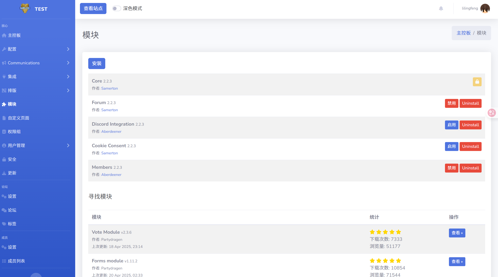
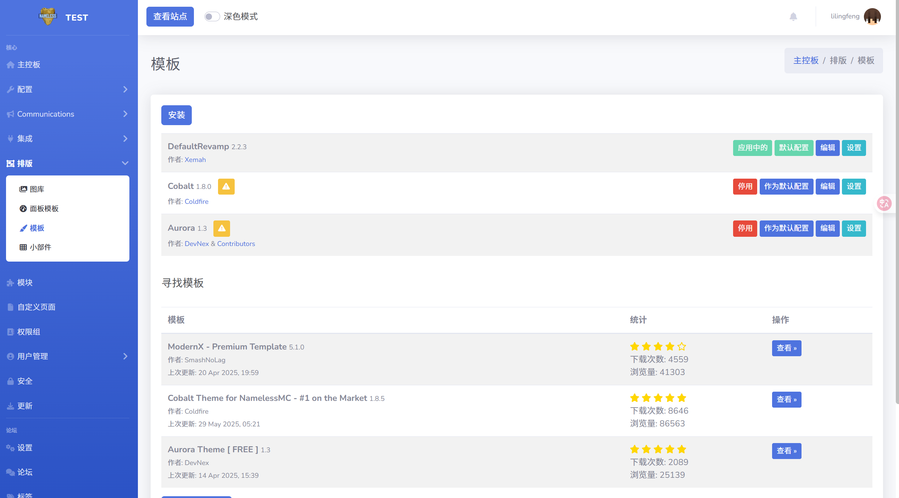

# 论坛插件

NamelessMC 有这非常多的插件,你可以在 [这里](https://namelessmc.com/resources/) 查看

以这个插件为例子 [FAQ](https://namelessmc.com/resources/resource/184-frequently-asked-questions/)

下载后解压,你会得到以下文件:

将 `upload` 文件夹复制到网站根目录即可，然后打开操作面板

点击安装即可，如果你安装的是样式模板,你应该在这里安装

