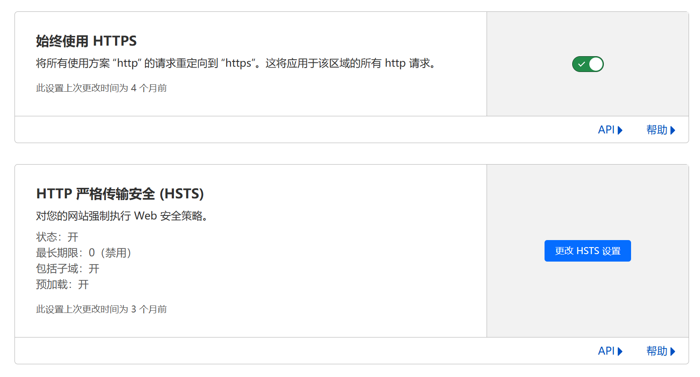

import Tabs from '@theme/Tabs';
import TabItem from '@theme/TabItem';

# 服务器配置

## Web 服务器配置

<Tabs groupId="webserver">
<TabItem value="nginx-http" label="Nginx(http)">

```nginx
# 定义一个虚拟主机块
server {
    # 监听 80 端口，即标准的 HTTP 协议端口
    listen 80;

    # 定义此虚拟主机响应的域名。你需要将 <domain> 替换为你的实际域名或本地开发域名 (如 myapp.local)
    server_name <domain>;

    # 设置网站文件的根目录
    root /var/www/html;
    # 设置默认的索引文件。当访问一个目录时，Nginx 会依次查找 index.php 和 index.html。
    index index.php index.html;

    # 允许更大的文件上传
    # 允许客户端请求体的最大大小为 100MB，这对于文件上传功能很重要。
    client_max_body_size 100m;

    # 添加安全相关的 HTTP 响应头
    # 尽管网站是 HTTP 的，但这些头部仍然可以提供一些基础的浏览器端安全保护。
    # 防止浏览器对内容类型进行MIME嗅探
    add_header X-Content-Type-Options nosniff;
    # 启用浏览器的 XSS (跨站脚本) 过滤器
    add_header X-XSS-Protection "1; mode=block";
    # 内容安全策略：只允许同源的页面将本页面作为 frame 嵌入，防止点击劫持
    add_header Content-Security-Policy "frame-ancestors 'self'";
    # 旧版浏览器防止点击劫持的响应头，只允许同源页面嵌入
    add_header X-Frame-Options "SAMEORIGIN";
    # 控制 Referer 头的发送策略，只在同源请求时发送完整的 Referer
    add_header Referrer-Policy same-origin;

    # 定义根路径 (/) 的请求处理方式
    location / {
        # 这是一个常见的 "前端控制器" 模式，用于 PHP 框架 (如 Laravel, Symfony, OpenCart 等)
        # 1. 尝试直接查找与 URI 匹配的文件 ($uri)
        # 2. 如果没找到，尝试查找与 URI 匹配的目录 ($uri/)
        # 3. 如果都没找到，则将请求重写到 /index.php，并将原始 URI 和参数作为查询字符串传递
        try_files $uri $uri/ /index.php?route=$uri&$args;
    }

    # 匹配以 .tpl, .cache, .htaccess 结尾的请求
    location ~ \.(tpl|cache|htaccess)$ {
        # 直接返回 403 Forbidden (禁止访问) 错误，防止模板、缓存、配置等敏感文件被公开访问
        return 403;
    }

    # 匹配以 /node_modules/ 开头的请求
    location ^~ /node_modules/ {
        # 直接返回 403 Forbidden 错误，防止开发依赖包被公开访问
        return 403;
    }

    # 匹配以 /scripts/ 开头的请求
    location ^~ /scripts/ {
        # 直接返回 403 Forbidden 错误，可以用于保护一些不想被直接访问的脚本目录
        return 403;
    }

    # 匹配所有以 .php 结尾的请求
    location ~ \.php$ {
        # 将请求通过 FastCGI 协议传递给 PHP-FPM (PHP FastCGI Process Manager) 进行处理。
        # 这里使用的是 Unix socket，它是一种在同一台机器上进行进程间通信的文件。
        # 它的路径可能需要根据你的系统配置进行修改 (例如，在不同PHP版本下可能是 php8.1-fpm.sock)。
        fastcgi_pass unix:/run/php/php-fpm.sock; # 可能需要编辑此行

        # 定义 FastCGI 的默认索引文件
        fastcgi_index index.php;

        # 设置 SCRIPT_FILENAME 变量，这是最重要的参数之一。
        # 它告诉 PHP-FPM 要执行哪个具体的脚本文件。
        # $document_root 是网站根目录， $fastcgi_script_name 是请求的脚本路径 (如 /index.php)。
        fastcgi_param SCRIPT_FILENAME $document_root$fastcgi_script_name;

        # 包含标准的 FastCGI 参数文件，这个文件定义了许多其他必要的 CGI 环境变量。
        include fastcgi_params;
    }
}
```

</TabItem>

<TabItem value="nginx-https" label="Nginx(https)">

```nginx
# 定义主网站的虚拟主机块
server {
    # 监听 443 端口，并启用 SSL/TLS 加密。同时启用 HTTP/2 协议以提升性能。
    listen 443 ssl http2;

    # 定义此虚拟主机响应的域名。同样，<domain> 需要替换为你的实际域名。
    server_name <domain>;

    # 设置网站文件的根目录
    root /var/www/html;
    # 设置默认的索引文件。当访问一个目录时，Nginx 会依次查找 index.php 和 index.html。
    index index.php index.html;

    # 允许更大的文件上传
    # 允许客户端请求体的最大大小为 100MB，这对于文件上传功能很重要。
    client_max_body_size 100m;

    # 这是一个基础的 TLS 配置示例，没有 OCSP Stapling，使用默认加密套件，也没有 HSTS。
    # 你可以访问 https://ssl-config.mozilla.org 生成一个更完善的配置。
    # 别忘了用你证书的实际路径替换下面的路径！
    # SSL 证书文件路径 (公钥)
    ssl_certificate /etc/letsencrypt/live/<domain>/fullchain.pem;
    # SSL 证书密钥文件路径 (私钥)
    ssl_certificate_key /etc/letsencrypt/live/<domain>/privkey.pem;

    # 添加安全相关的 HTTP 响应头
    # 防止浏览器对内容类型进行MIME嗅探
    add_header X-Content-Type-Options nosniff;
    # 启用浏览器的 XSS (跨站脚本) 过滤器
    add_header X-XSS-Protection "1; mode=block";
    # 内容安全策略：只允许同源的页面将本页面作为 frame 嵌入，防止点击劫持
    add_header Content-Security-Policy "frame-ancestors 'self'";
    # 旧版浏览器防止点击劫持的响应头，只允许同源页面嵌入
    add_header X-Frame-Options "SAMEORIGIN";
    # 控制 Referer 头的发送策略，只在同源请求时发送完整的 Referer
    add_header Referrer-Policy same-origin;

    # 定义根路径 (/) 的请求处理方式
    location / {
        # 这是一个常见的 "前端控制器" 模式，用于 PHP 框架 (如 Laravel, Symfony, OpenCart 等)
        # 1. 尝试直接查找与 URI 匹配的文件 ($uri)
        # 2. 如果没找到，尝试查找与 URI 匹配的目录 ($uri/)
        # 3. 如果都没找到，则将请求重写到 /index.php，并将原始 URI 和参数作为查询字符串传递
        try_files $uri $uri/ /index.php?route=$uri&$args;
    }

    # 匹配以 .tpl, .cache, .htaccess 结尾的请求
    location ~ \.(tpl|cache|htaccess)$ {
        # 直接返回 403 Forbidden (禁止访问) 错误，防止敏感文件被公开访问
        return 403;
    }

    # 匹配以 /node_modules/ 开头的请求
    location ^~ /node_modules/ {
        # 直接返回 403 Forbidden 错误
        return 403;
    }

    # 匹配以 /scripts/ 开头的请求
    location ^~ /scripts/ {
        # 直接返回 403 Forbidden 错误
        return 403;
    }

    # 匹配所有以 .php 结尾的请求
    location ~ \.php$ {
        # 将请求通过 FastCGI 协议传递给 PHP-FPM 处理。
        # 这里使用的是 Unix socket，路径可能需要根据你的系统配置进行修改。
        fastcgi_pass unix:/run/php/php-fpm.sock; # 可能需要编辑此行
        # 定义 FastCGI 的默认索引文件
        fastcgi_index index.php;
        # 设置 SCRIPT_FILENAME 变量，告诉 PHP-FPM 要执行哪个脚本文件
        fastcgi_param SCRIPT_FILENAME $document_root$fastcgi_script_name;
        # 包含标准的 FastCGI 参数文件
        include fastcgi_params;
    }
}
```

</TabItem>
<TabItem value="apache-http" label="Apache(http)">

```apache
# 定义一个虚拟主机块。它会监听所有 IP 地址 (*) 的 80 端口。
<VirtualHost *:80>
    # 设置此虚拟主机对应的域名。Apache 会根据客户端请求的 Host 头来匹配这个名字。
    # 你需要将 <domain> 替换为你的实际域名，例如 www.example.com。
    ServerName <domain>

    # 设置网站文件的根目录。当用户访问网站时，Apache 会从这个目录提供文件。
    DocumentRoot "/var/www/html"

    # 允许 URL 中包含编码后的斜杠 (例如 %2F)，并且不进行解码。
    # 这对于某些 RESTful API 或需要将文件路径作为 URL 参数传递的应用程序是必需的。
    # 默认情况下，Apache 会拒绝这类请求。
    AllowEncodedSlashes NoDecode

    # 这两个是 PHP 的配置项，通过 Apache 的 mod_php 模块来设置。
    # 设置允许上传的单个文件的最大大小为 100MB。
    php_value upload_max_filesize 100M
    # 设置 POST 请求体数据的最大大小为 100MB。
    # 这个值必须大于或等于 upload_max_filesize 才能成功上传大文件。
    php_value post_max_size 100M

    # 这是一个目录配置块，用于定义针对特定文件系统目录的规则。
    # 它应用于网站的根目录。
    <Directory "/var/www/html">
      # 允许在此目录及其子目录中使用 .htaccess 文件来覆盖这里的配置。
      # "all" 意味着 .htaccess 文件拥有最大的权限，这对于像 WordPress 这样的应用很常见，
      # 它们使用 .htaccess 来管理 URL 重写（永久链接）。
      AllowOverride all

      # 这是 Apache 2.4+ 的访问控制指令。
      # "Require all granted" 表示无条件地允许所有客户端访问此目录。
      # 这是向公众提供网站内容所需的标准设置。
      Require all granted
    </Directory>
</VirtualHost>
```

</TabItem>

<TabItem value="apache-https" label="Apache(https)">

```apache
# 定义一个监听所有 IP 地址 (*) 的 443 端口 (HTTPS) 的虚拟主机。
<VirtualHost *:443>
    # 设置此虚拟主机对应的域名。
    ServerName <domain>
    # 设置网站文件的根目录。
    DocumentRoot "/var/www/html"

    # 允许 URL 中包含编码后的斜杠 (%2F) 并且不进行解码。
    AllowEncodedSlashes NoDecode

    # 通过 mod_php 设置 PHP 的上传文件大小限制为 100MB。
    php_value upload_max_filesize 100M
    # 设置 POST 请求体数据的最大大小为 100MB。
    php_value post_max_size 100M

    # 定义针对网站根目录的特定配置。
    <Directory "/var/www/html">
      # Apache 2.4+ 语法：允许所有客户端访问此目录。
      Require all granted
      # 允许在此目录及子目录中使用 .htaccess 文件来覆盖服务器配置。
      AllowOverride all
    </Directory>

    # 为此虚拟主机开启 SSL/TLS 引擎。这是启用 HTTPS 的关键。
    SSLEngine on
    # 指定 SSL 证书文件 (公钥) 的路径。
    # fullchain.pem 包含了服务器证书和所有必需的中间证书链。
    SSLCertificateFile /etc/letsencrypt/live/<domain>/fullchain.pem
    # 指定 SSL 证书私钥文件的路径。
    SSLCertificateKeyFile /etc/letsencrypt/live/<domain>/privkey.pem
    

</VirtualHost>

```
</TabItem>

</Tabs>

## Cloudflare

如果你不想自己配置 SSL 证书,你可以通过使用 Cloudflare 的免费 SSL 服务来提供 HTTPS 功能。
Cloudflare 的免费 SSL 服务可以为你的网站提供免费的 SSL 证书，无需任何额外的配置。


(严格一点需要调整加密模式)



你也可以把`始终使用 HTTPS` 和 `HTTP 严格传输安全 (HSTS)` 打开

### 源服务器加密


如果你希望提高 Cloudflare 到源服务器的安全性，可以使用源服务器加密来实现。

创建证书后,按照服务器配置配置证书,开启`经过身份验证的源服务器拉取` 即可

### 代理配置

通过代理连接会导致两个问题：

* NamelessMC 会看到你的代理地址而不是你的用户地址。这会破坏 IP 封锁和速率限制。这可以通过从代理向后端 Web 服务器发送 Forwarded 、 X-Forwarded-For 或 X-Real-IP （不推荐）标头来解决。

在你的 Nginx 配置文件中添加如下几行:

```nginx
proxy_set_header X-Forwarded-For    $proxy_add_x_forwarded_for;
proxy_set_header X-Forwarded-Proto  $scheme;
proxy_set_header X-Forwarded-Port   $server_port;
```

在 Nginx 配置文件 http 段配置：

```nginx
set_real_ip_from 0.0.0.0/0;
real_ip_header X-Forwarded-For;
```

