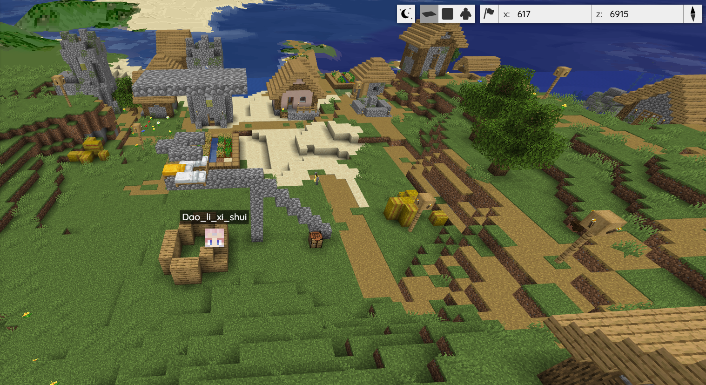

# 卫星地图

通过此类功能的 Mod/Plugin 可以生成一个与服务端存档相对应的即时网页地图，通常以俯视、斜视或 3D 模型的形式呈现。

## BlueMap

:::info

`官网` https://bluemap.bluecolored.de/

`GitHub` https://github.com/BlueMap-Minecraft/BlueMap

`官方演示地图` https://bluecolored.de/bluemap

`文档` https://bluemap.bluecolored.de/wiki/

:::

一款非常简单好用的 Mod，将服务器地图以 3D 的方式在 Web 浏览器中进行查看，支持俯视角、第一人称、第三人称的多种地图查看方式。另外支持查看玩家的实时位置，以及玩家可以在卫星地图中添加自定义标记。

