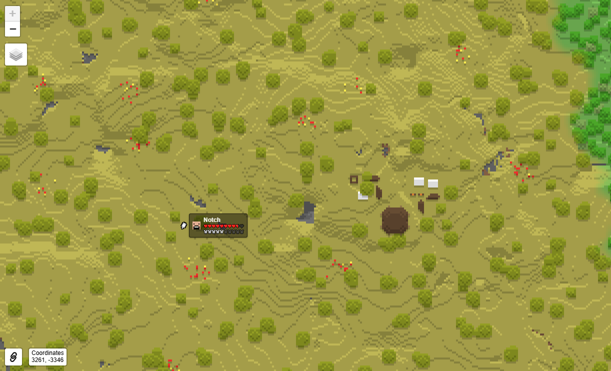
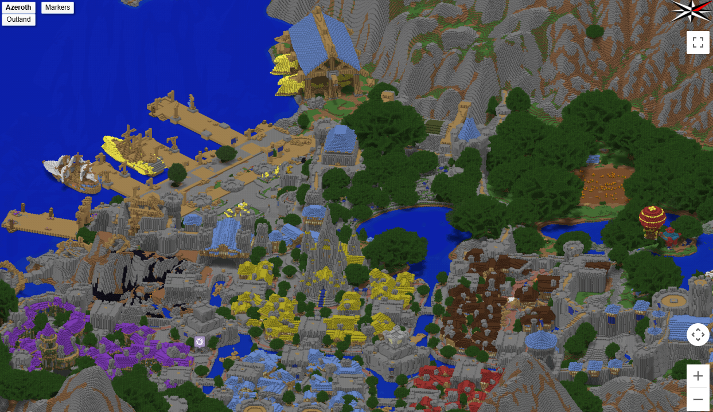

# 卫星地图

通过此类功能的 Mod/Plugin 可以生成一个与服务端存档相对应的即时网页地图，通常以俯视、斜视或 3D 模型的形式呈现。

## BlueMap

:::info

`官网` https://bluemap.bluecolored.de/

`GitHub` https://github.com/BlueMap-Minecraft/BlueMap

`官方演示地图` https://bluecolored.de/bluemap

`文档` https://bluemap.bluecolored.de/wiki/

:::

一款非常简单好用的 Mod，将服务器地图以 3D 的方式在 Web 浏览器中进行查看，支持 2D 俯视角、第一人称、第三人称的多种地图查看方式。另外支持查看玩家的实时位置，以及玩家可以在卫星地图中添加自定义标记。

## Dynmap

:::info

`GitHub` https://github.com/webbukkit/dynmap

`官方演示地图` https://map.massivecraft.com

`文档` https://github.com/webbukkit/dynmap/wiki

:::

一款历史悠久的卫星地图 Mod，支持用户在浏览器上查看服务器内的地图、玩家信息和其它一些附属功能，例如出生点、当前时间、是否下雨等，支持 2D 俯视角视图和 3D 俯视角视图查看。

## squaremap

:::info

`GitHub` https://github.com/jpenilla/squaremap

`官方演示地图` https://squaremap-demo.jpenilla.xyz

`文档` https://github.com/jpenilla/squaremap/wiki

:::

squaremap 是一款优化了资源的加载和显示的卫星地图 Mod，采用了低精度的图片素材渲染地图，界面设计简洁、易于使用，仅支持 2D 俯视角视图查看。

## Overviewer

:::info

`GitHub` https://github.com/overviewer/Minecraft-Overviewer

`官方演示地图` https://overviewer.org/wow

`文档` https://docs.overviewer.org/en/latest/

:::

Overviewer 是一款静态地图渲染工具，可以产出一个非实时更新的网页地图，仅支持 3D 俯视角视图查看。

